# Car-Pooling-App
Major Project [Associated with ADVANCED ANDROID APP DEVELOPMENT Subject [CSE227] at Lovely Professional University]

# Project Overview

This project aims to create a Car Pooling App using Android Studio and Kotlin. It includes the following features:

1. **Sign In:** Users can log in with their credentials. This feature ensures that only registered users can access the app's functionalities, maintaining security and privacy.

2. **Sign Up:** To access the app's features, users must first register for a new account and then log in. New users can use the app's tailored offerings after registering.

3. **View and Update Profile:** Users are able to see and modify the information in their profile, including their name, email address, etc. This guarantees the accuracy and currency of user data.

4. **Rating System:** Users have the option to review and comment on their experiences, and the rating is kept in the database. Users can also see the average rating given by all users and receive notifications regarding ratings.

5. **Feedback Form:** Through this form, users can send in questions or feedback. A little check dialog box appears as confirmation after submission, making the user experience pleasant.

6. **Category Selection:** Depending on their requirements, users can choose to be either a rider or an owner of a car. This classification, which takes into account personal preferences, simplifies the user experience.

7. **Offer Rides:** Users are able to peruse and observe every ride that is available, together with information about the start and end times.

8. **Owner Profile:** Users have access to comprehensive profiles of automobile owners that include facts about seats that are accessible, contact information (such as an email address or phone number), and other pertinent data.

9. **Proximity Sensor (Alert System):** To lessen eye strain and possible discomfort, the app uses a proximity sensor to warn users when they are getting too close to the screen. This feature makes using the app safer and more pleasant, which improves the user experience.

10. **Create a Ride:** Through the app, users can generate rides. For further protection, they must go through phone verification and obtain a confirmation email.

11. **Book a Ride:** Through the app, users can suggest rides. Users receive emails confirming their reservations, and for extra security, they must verify over the phone.

12. **Nearby Riders (Map View):** On the map view, users can see nearby riders, who are shown as person icons. This feature improves user visibility and makes ride selection easier by using Open Street Map view to display nearby riders' real-time positions.

13. **Nearby Cars (Map View):** Using the car symbols on the map view, users can see the locations of nearby cars.

14. **Search:** Users can go through all of the available riders and rides that other users have provided by using the search functionality. To identify particular rides based on user preferences, the search feature contains filtering options.

15. **Share the App:** Through a Web View, users can obtain the app code and distribute it to other users. With social media sharing and other means, users can use this feature to spread the word about the app and increase its user base.

16. **Logout:** The ability to log out of an account is available to users. When you click the logout button, a confirmation dialog box shows up.

17. **Frequently Asked Questions (FAQs):** It provides users with a thorough rundown of frequently asked questions about the app, its features.

18. **WiFi Info:** Users are able to get comprehensive details about the WiFi network they are currently connected to.

19. **Details About the App Creator:** Users can obtain information about the App Creator, such as background information, methods of contact (phone, email, or SMS), and ways to report issues with the app's usability or operation.

20. **Turn on WiFi:** With this function, users can easily turn on WiFi right from within the app. Because internet access is necessary for the proper operation of apps, users can assure seamless and uninterrupted app usage by tapping the "Enable Wifi" option on their smartphone.

21. **Text-to-Speech (TTS):** This feature improves accessibility and user interaction by allowing users to convert text input into spoken language output in one of five languages.
    
23. **Speech-to-Text (STT):** Users can speak to transmit data; the speech is converted to text and shown in the application's text view ( only English ).

## Working Project Video

## Project Images

    <!-- Replace 'project_images' with your actual image directory path -->
    
    
    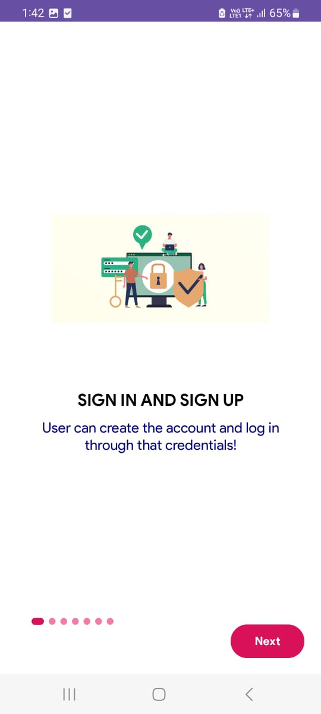
    
    

    
    
    
    
    

    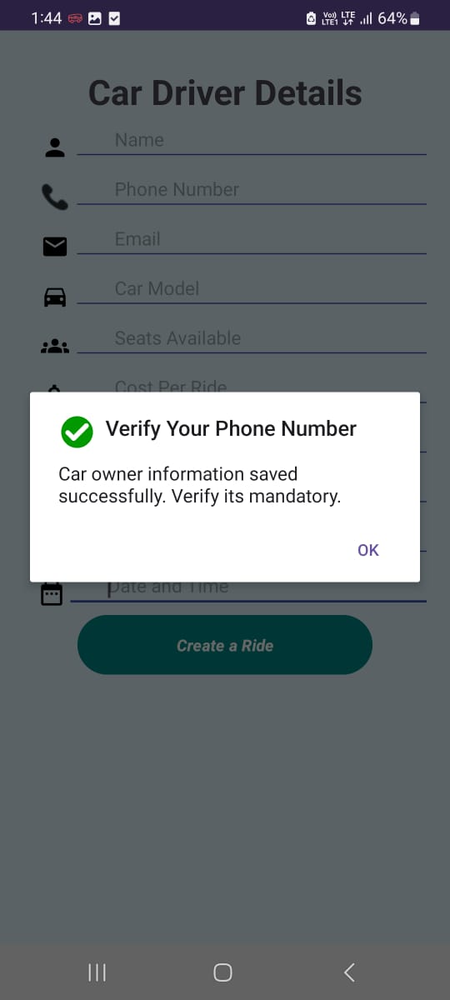
    
    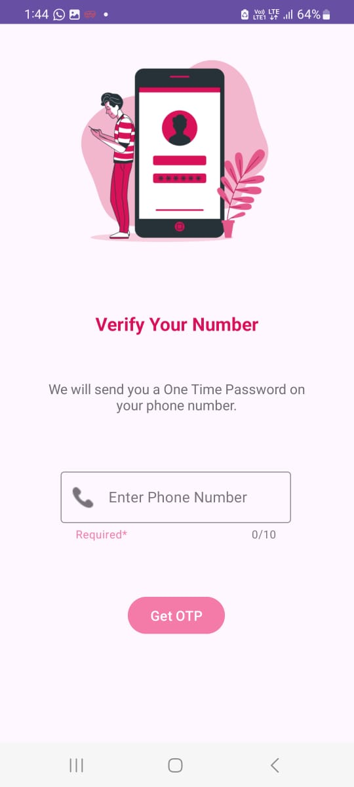
    
    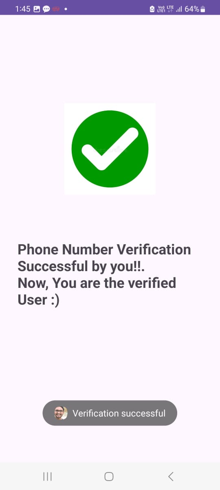

    
    
    
    
    

    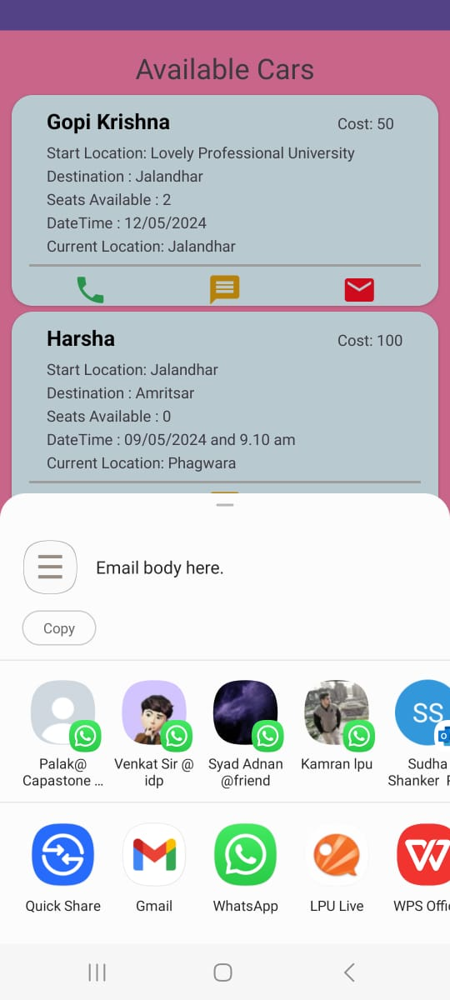
    
    
    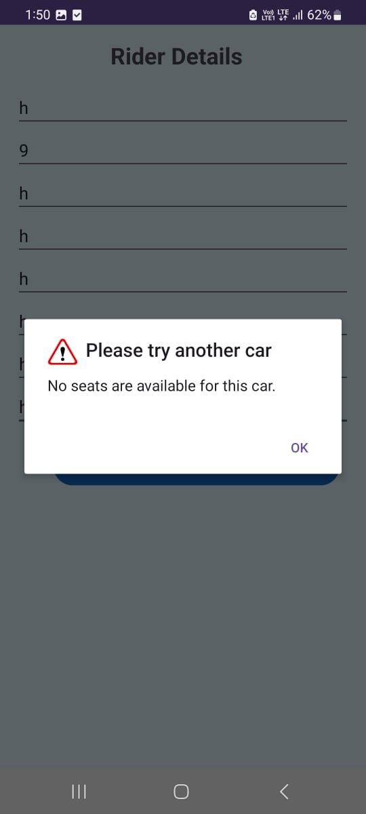
    

    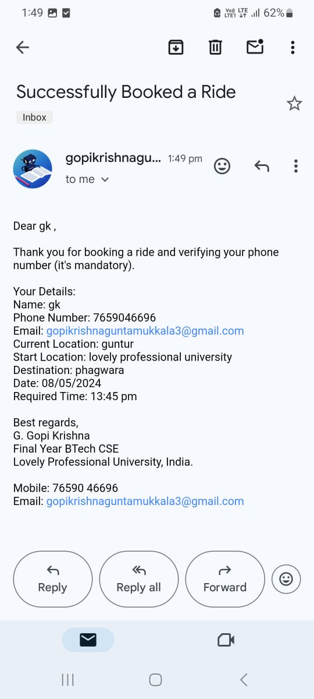
    
    
    
    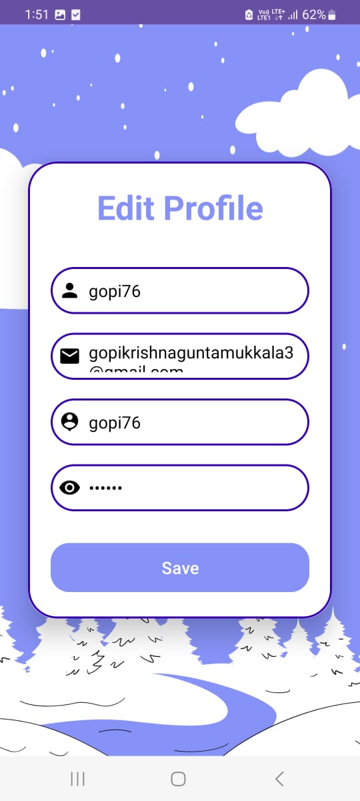

    
    
    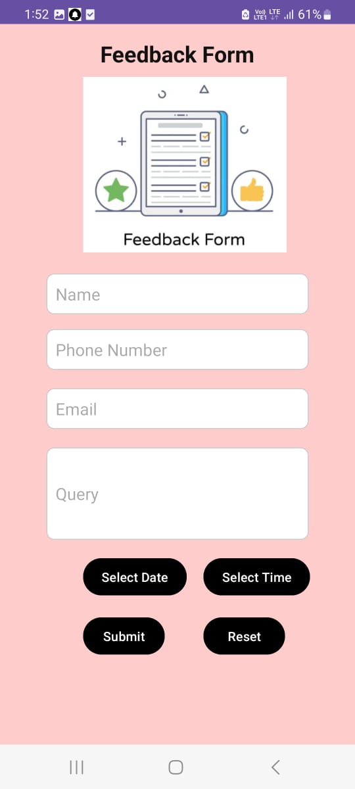
    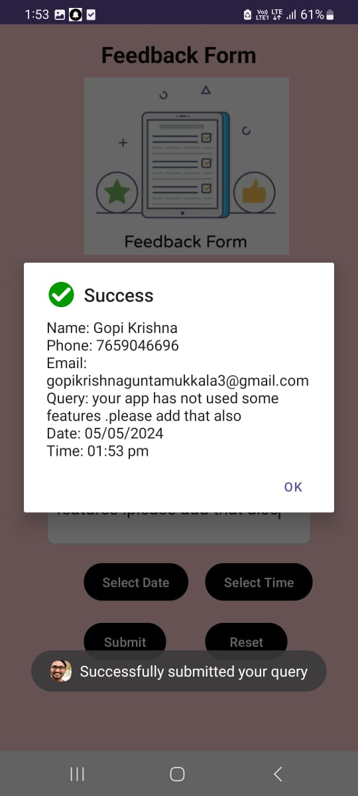
    

    
    
    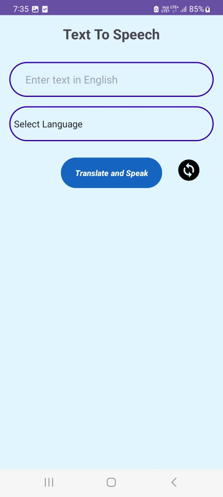
    
    

    
    
    

## Note:

1. **Email Confirmation for Ride Booking:**
   - To enable email confirmation for ride bookings, a 16-digit unique code is generated via email. Update the sender's Gmail address and the 16-digit unique key in the codebase to activate this feature.

2. **SMTP with Gmail:**
   - SMTP (Simple Mail Transfer Protocol) is used with Gmail to send email notifications for ride confirmations. Configure the sender's Gmail address in the application for email functionality.

3. **Firebase Realtime Database:**
   - The app utilizes Firebase Realtime Database to store and manage details such as car owner information, login credentials, ratings, feedback, and rider details. Ensure proper Firebase setup for seamless data management.

4. **Firebase Authentication (Phone Verification):**
   - Firebase Authentication is integrated for phone verification. Note that the free version limits to 10 SMS verifications per day. Configure Firebase Auth settings accordingly.

5. **Firebase Rules Configuration:**
   - Firebase rules for both read and write operations are set to **true** to avoid any issues related to database access. Ensure Firebase rules are properly configured for development and testing purposes.

6. **Running the Project:**
   - To run the project on your system:
     - Clone the repository using Git: `git clone https://github.com/yourusername/carpooling-app.git`
     - Open Android Studio and import the project from Version Control (Git).
     - Paste the repository URL and proceed to clone the project.
     - Update necessary configurations such as Gmail sender address and Firebase setup within the codebase.
     - Run the project in Android Studio to launch the Car Pooling App.

7. **API Level Requirement for Enable WiFi Button:**
   - The "Enable WiFi" button functionality is compatible with API levels below 27. Ensure the appropriate Android API level is installed to utilize this feature.

---

*This section provides essential notes and instructions for setting up and running the Car Pooling App project. Done by Gopi Krishna*

